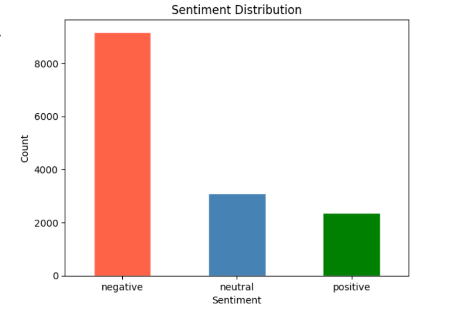
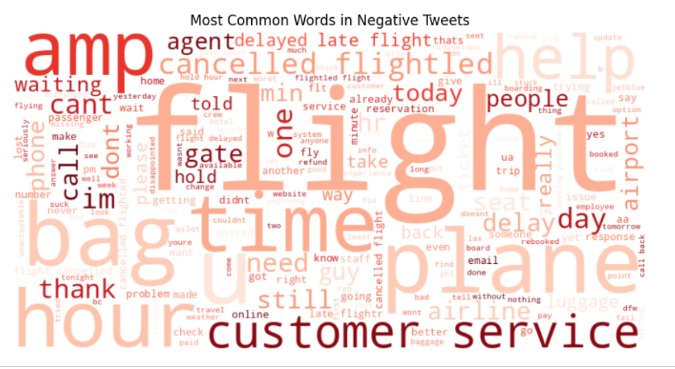
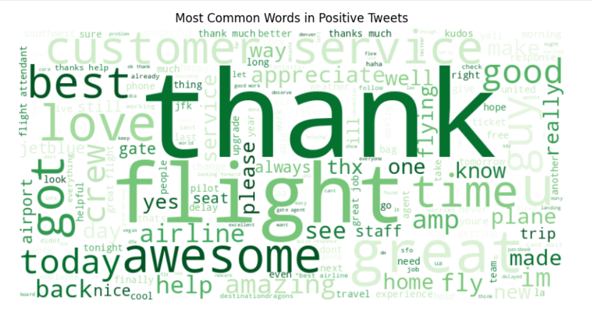

# Twitter Airline Sentiment Analysis

## Overview
Sentiment analysis on 14,000+ tweets about US airlines, classifying 
customer opinions into Positive, Neutral and Negative categories 
using NLP and machine learning techniques.

## Tools & Libraries
- Python (Pandas, NumPy, Matplotlib, Seaborn)
- NLTK (tokenization, stopword removal)
- Scikit-learn (TF-IDF, Logistic Regression, Naive Bayes)
- WordCloud
- Google Colab

## Dataset
- **Source:** Kaggle — Twitter US Airline Sentiment
- **Size:** 14,640 tweets
- **Airlines:** United, American, Southwest, Delta, Virgin, US Airways
- **Classes:** Positive (16%), Neutral (21%), Negative (63%)

## Project Steps
1. Data loading and exploration
2. Text preprocessing — lowercasing, removing @mentions, URLs, punctuation, stopwords
3. TF-IDF Vectorization with bigrams (max 5000 features)
4. Handling class imbalance using SMOTE
5. Training Logistic Regression and Naive Bayes models
6. Evaluation using F1 score and confusion matrix
7. EDA — sentiment distribution, airline-wise analysis, word clouds

## Results
| Model | F1 Score |
|---|---|
| Logistic Regression | 0.7645 |
| Naive Bayes | 0.6936 |

🏆 Best Model: Logistic Regression (F1 = 0.76)

## Key Findings
- 63% of tweets are negative — majority of customers are unhappy
- United and American Airlines receive the most negative sentiment
- Virgin America has the highest proportion of positive tweets
- Most common negative triggers — flight delays, cancellations, lost baggage
- Neutral tweets are hardest to classify — often confused with negative

## Business Recommendations
- United and American Airlines need urgent customer service improvement
- Focus on reducing flight delays — most common negative trigger
- Replicate Virgin America's service model across other airlines
- Monitor real-time tweet sentiment to catch issues early
- Target neutral customers with proactive engagement

## Dashboard Preview

### Sentiment Distribution

### Word Cloud — Negative Tweets

### Word Cloud — Positive Tweets

